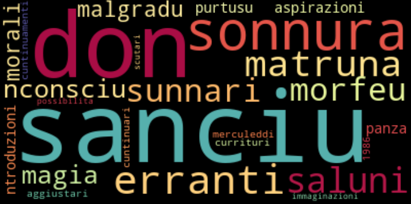
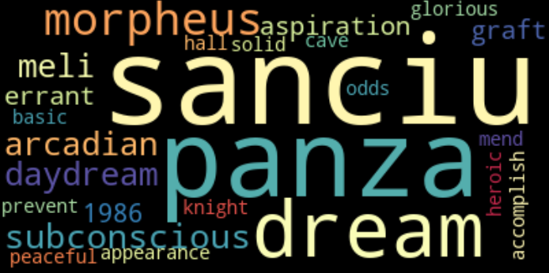

# Sicilian Translator / embeddings

This directory contains experimental work.  None of the scripts here enter the translation model, but the ideas do.

The [Transformer](https://arxiv.org/abs/1706.03762) model has word embeddings at the base of its encoder and decocer stacks.  [Sockeye](https://awslabs.github.io/sockeye/) lets us examine those embeddings, but they're embeddings of subword units and therefore only useful for the task of translation.

What a human being would want to know is what words are associated with each other.  And that's where word embeddings shine, so in this directory we lemmatize the text of both languages and use [Gluon NLP](https://gluon-nlp.mxnet.io/examples/word_embedding/word_embedding_training.html)'s `train_sg_cbow.py` training script (and utilities) to train the [word2vec](https://en.wikipedia.org/wiki/Word2vec) embedding models proposed by [Mikolov et al. (2013)](https://arxiv.org/abs/1301.3781).

Then, in future work, we can compute the matrix of cosine similarity from the embeddings and use that matrix to create lists of context similar words for our dictionary, [_Chiù dâ Palora_](https://www.napizia.com/cgi-bin/cchiu-da-palora.pl).

##  References

Mikolov, et al. (2013). "[Efficient Estimation of Word Representations in Vector Space](https://arxiv.org/abs/1301.3781)."

MXNet Gluon NLP. "[Word Embeddings Training and Evaluation](https://gluon-nlp.mxnet.io/examples/word_embedding/word_embedding_training.html)."

##  Quixotic Clouds

And since we're working with word embeddings ... We created some word clouds just because we could.  These visualizations don't tell us much, but they were fun to create.  Below are word clouds from Skipgram models of the word "chisciotti" -- one of the title characters of Giovanni Meli's [_Don Chisciotti e Sanciu Panza_](https://en.wikipedia.org/wiki/Giovanni_Meli#Don_Chisciotti_e_Sanciu_Panza_%28Cantu_quintu%29).  The idea of the Skipgram model is to predict a set of context words that might surround the word "chisciotti":

 
